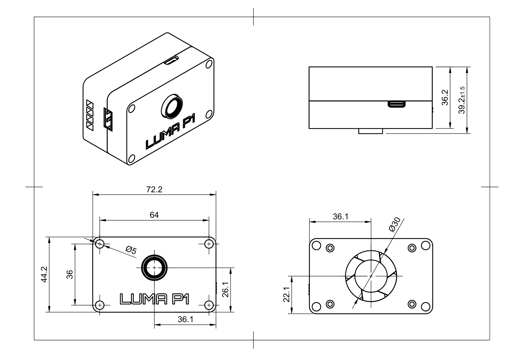

# Mounting the Luma P1

!!! info "About This Page"
    This page explains how to securely and safely mount your Luma P1 camera on a robot or test bench.

---

## Mounting Points

The Luma P1 enclosure features four 5mm (0.2") through-holes, one in each corner. These holes are compatible with #10 or M4 bolts, making it easy to attach the device to a variety of surfaces. The enclosure is electrically isolated, so you do **not** need to insulate your mount from the robot frame.

---

## Cooling and Airflow

!!! warning "Do Not Block the Fan"
    When designing your mounting solution, **do not block the fan grate** on the back of the device. Obstructing the fan will prevent proper cooling and may cause overheating. Either leave a hole in your mount for airflow, or use spacers to create a gap between the fan and the mounting surface.

If you cannot add an air hole, a printable spacer with an airflow channel is [available here](https://makerworld.com/en/models/1939322-luma-p1-airflow-spacer). This spacer will also be available for purchase, printed with the same high-strength, heat-resistant filament as the P1 enclosure.

---

## Mounting Diagram

---

!!! tip "Need Help?"
    For mounting questions or custom solutions, reach out to the FRC 5892 community or check the [troubleshooting guide](troubleshooting.md).