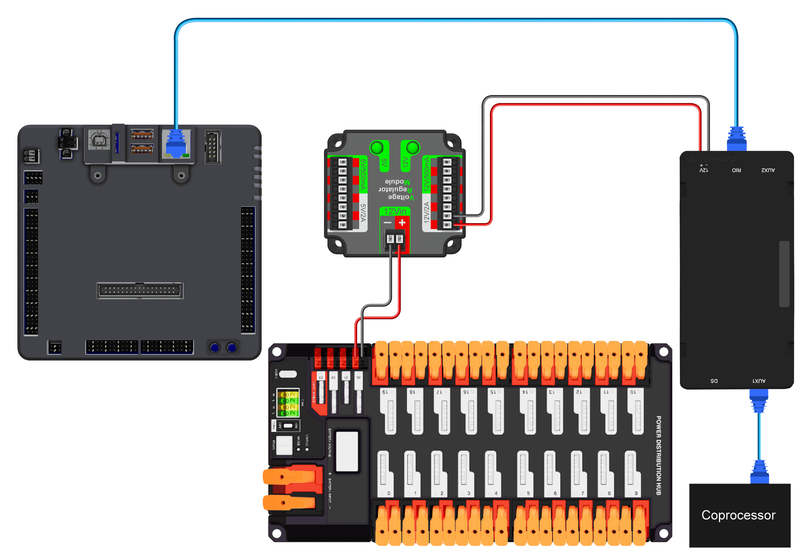

# Luma Networking

This guide covers physical wiring and networking setup for Luma coprocessors using PhotonVision.

!!! info "Unofficial Docs"
    This is an unofficial community guide. For the official Luma documentation, see
    [docs.luma.vision/p1](https://docs.luma.vision/p1/).

---

## Physical Networking

!!! warning "Off-Robot Networking Requirement"
    When using PhotonVision off robot, you must plug the coprocessor into a physical
    router/radio and connect your laptop to that same network. Other networking setups are
    unreliable and generally unsupported.

### New Radio (2025-Present)

!!! danger
    Ensure DIP switches **1 and 2 are OFF** on the radio before connecting the coprocessor.
    Incorrect PoE settings can electrically damage the coprocessor.

Recommended wiring path:

- **radio -> switch -> coprocessor(s) + laptop**

!!! note "Using LumaSwitch"
    If you are using LumaSwitch, use the non-PoE uplink port for the radio connection and only
    install PoE fuses on ports that should provide passive PoE.

For full switch specs/mounting/wiring details, see the [LumaSwitch Guide](../guides/lumaswitch/overview.md).

{ width="900" }

### Old Radio (Pre-2025)

Direct radio/switch Ethernet networking can still work, but verify your topology and power
settings before testing.

---

## Network Hostname

Rename each device from the default `photonvision` hostname to a unique value such as
`Photon-OrangePi-Left` or `Photon-RPi5-Back`.

1. Open PhotonVision and go to **Settings -> Networking**.
2. Change hostname from `photonvision` to a unique value.
3. Use only letters (`A-Z`), numbers (`0-9`), and hyphens (`-`).

Unique hostnames help you manage multiple coprocessors reliably.

---

## Robot Networking (Static IP)

PhotonVision strongly recommends static IPs on the robot network for reliability.

!!! warning
    Use static IP mode only on your robot network. Do not force static settings on random home
    networks unless you are comfortable managing local network configuration.

1. Power the robot and connect your laptop to the robot network.
2. Open PhotonVision at `photonvision.local:5800` (or your current device address).
3. Go to **Settings -> Networking**.
4. Enter your team number.
5. Set IP mode to **Static**.
6. Set the coprocessor IP to `10.TE.AM.xx` where `xx` is unique on your robot (commonly `.6`
   through `.19`).
7. Click **Save**.
8. Power-cycle robot and coprocessor.
9. Reconnect using `10.TE.AM.xx:5800`.

!!! note "Team Number Field Tip"
    The team number field can also accept a hostname or IP (for example `localhost`) when you
    are testing with a simulated robot program.

---

## Port Forwarding

!!! note
    If you are using a VH-109 radio (2025 and later, excluding China and Taiwan), prefer
    tethering to the dedicated DS Ethernet port instead of using port forwarding.

If you need to view an Ethernet-connected vision device while tethered over roboRIO USB,
WPILib `PortForwarder` can forward the PhotonVision web UI port.

```java
PortForwarder.add(5800, "photonvision.local", 5800);
```

!!! note
    Replace `photonvision.local` with your actual coprocessor hostname if you changed it.

---

## Camera Stream Ports

- Camera streams start at ports `1181` and `1182` for camera 1.
- Each additional camera uses the next two ports (`1183/1184`, `1185/1186`, etc.).
- A quick way to identify a stream port is to double-click the stream in PhotonVision and check
  the opened page URL.

!!! warning
    If stream forwarding remaps to a different port than the original stream port, the stream may
    not render correctly in the UI.

---

## SSH Access (Advanced)

- SSH is available for advanced troubleshooting/configuration.
- Default credentials for image `v2026.0.3+` are `photon` / `vision`.
- Legacy credentials `pi` / `raspberry` may still work, but are expected to be removed in a
  future release.

---

## Next Steps

After networking is set up, continue with the **[Calibration Guide](calibration.md)**.
